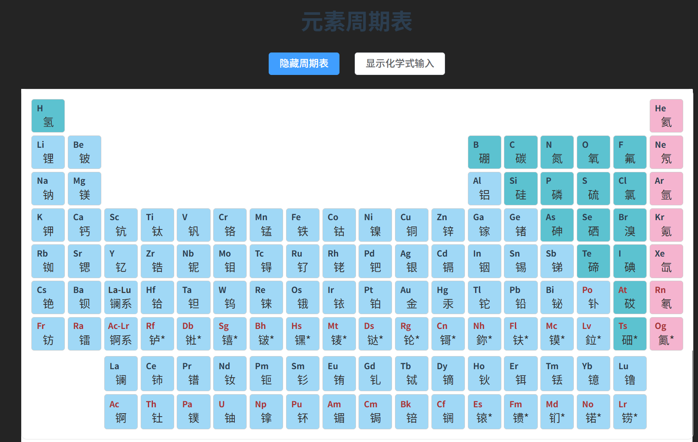

# 交互式元素周期表 (Interactive Periodic Table)

一个基于 Vue 3 + TypeScript + Element Plus 构建的交互式元素周期表应用，支持元素信息展示、化学式输入和交互操作。

## 项目预览



## 功能特性

- 完整的元素周期表展示（118个元素）
- 元素分类着色（稀有气体、碱金属、碱土金属、过渡金属、非金属、卤素、类金属、镧系、锕系等）
- 鼠标悬停显示元素详细信息
  - 元素符号
  - 原子序数
  - 中文名称
  - 英文名称
  - 相对原子质量
- 点击元素添加到化学式
- 化学式输入模式
  - 数字按钮（0-9）
  - 括号和乘号
  - 清除功能
- 响应式设计
- 交互式动画效果

## 技术栈

- **Vue 3.5.13** - 渐进式 JavaScript 框架
- **TypeScript 5.6.2** - JavaScript 的超集
- **Vite 6.0.5** - 下一代前端构建工具
- **Element Plus 2.13.5** - Vue 3 组件库
- **SCSS** - CSS 预处理器

## 安装步骤

### 环境要求

- Node.js >= 20.10.0
- npm 或 pnpm 或 yarn

### 克隆项目

```bash
git clone https://github.com/your-username/interactive-periodic-table.git
cd interactive-periodic-table
```

### 安装依赖

```bash
npm install
```

或使用 pnpm：

```bash
pnpm install
```

或使用 yarn：

```bash
yarn install
```

## 使用方法

### 开发模式

启动开发服务器：

```bash
npm run dev
```

应用将在 http://localhost:5173/ 启动。

### 构建生产版本

```bash
npm run build
```

构建产物将生成在 `dist` 目录中。

### 预览生产版本

```bash
npm run preview
```

## 项目结构

```
interactive-periodic-table/
├── public/                 # 静态资源
├── src/
│   ├── assets/            # 资源文件
│   │   └── search/        # 搜索相关资源
│   ├── components/        # 组件
│   │   └── periodicTable/ # 周期表组件
│   │       └── index.vue  # 周期表主组件
│   ├── data/              # 数据文件
│   │   └── elements.json  # 元素数据
│   ├── App.vue            # 根组件
│   ├── main.ts            # 应用入口
│   └── style.css          # 全局样式
├── index.html             # HTML 模板
├── package.json           # 项目配置
├── tsconfig.json          # TypeScript 配置
├── vite.config.ts        # Vite 配置
└── README.md             # 项目说明
```

## 组件说明

### PeriodicTable 组件

周期表主组件，位于 `src/components/periodicTable/index.vue`。

#### Props

| 属性名 | 类型 | 默认值 | 说明 |
|--------|------|--------|------|
| periodicTableIsOpen | Boolean | true | 是否显示周期表 |
| showChemFormula | Boolean | false | 是否显示化学式输入 |

#### Events

| 事件名 | 参数 | 说明 |
|--------|------|------|
| onInput | value: string | 当用户点击元素或数字按钮时触发 |

#### 功能

- **主表元素**：显示周期表主表（1-56, 72-88号元素）
- **镧系元素**：显示镧系元素（57-71号元素）
- **锕系元素**：显示锕系元素（89-103号元素）
- **元素分类**：根据元素类别显示不同颜色
- **悬停提示**：鼠标悬停显示元素详细信息
- **化学式输入**：支持输入化学式和数字

## 元素数据

元素数据存储在 `src/data/elements.json` 文件中，包含以下字段：

```typescript
{
  "atomicNumber": 1,      // 原子序数
  "symbol": "H",          // 元素符号
  "zhName": "氢",         // 中文名称
  "enName": "Hydrogen",   // 英文名称
  "atomicWeight": 1.008,  // 相对原子质量
  "category": "非金属",   // 元素类别
  "period": 1,            // 周期
  "group": 1              // 族
}
```

## 元素分类


- **稀有气体** (Noble Gases) - 粉色 (#F5B4CF)
- **碱金属** (Alkali Metals) - 浅绿色 (#ccffcc)
- **碱土金属** (Alkaline Earth Metals) - 浅蓝色 (#ccccff)
- **过渡金属** (Transition Metals) - 浅蓝色 (#ccf2ff)
- **非金属** (Nonmetals) - 青色 (#5CC2D0)
- **卤素** (Halogens) - 浅紫色 (#ffccff)
- **类金属** (Metalloids) - 浅绿色 (#e6ffcc)
- **镧系** (Lanthanides) - 浅蓝色 (#A0D8F6)
- **锕系** (Actinides) - 浅蓝色 (#A0D8F6)
- **金属** (Metals) - 浅蓝色 (#A0D8F6)

## 开发说明

### 添加新功能

1. 在 `src/components/periodicTable/index.vue` 中添加新功能
2. 如需修改元素数据，编辑 `src/data/elements.json`
3. 样式修改在组件的 `<style>` 标签中

### 代码规范

- 使用 TypeScript 进行类型检查
- 使用 Composition API (`<script setup>`)
- 遵循 Vue 3 最佳实践
- 使用 SCSS 编写样式

## 浏览器支持

- Chrome (推荐)
- Firefox
- Safari
- Edge

## 许可证

MIT License

## 贡献

欢迎提交 Issue 和 Pull Request！

## 联系方式

如有问题或建议，请通过以下方式联系：

- 提交 Issue
- 发送邮件

## 更新日志

### v1.0.0 (2026-03-13)

- 初始版本发布
- 完整的元素周期表展示
- 元素信息悬停显示
- 化学式输入功能
- 响应式设计

## 致谢

感谢所有为这个项目做出贡献的开发者！
